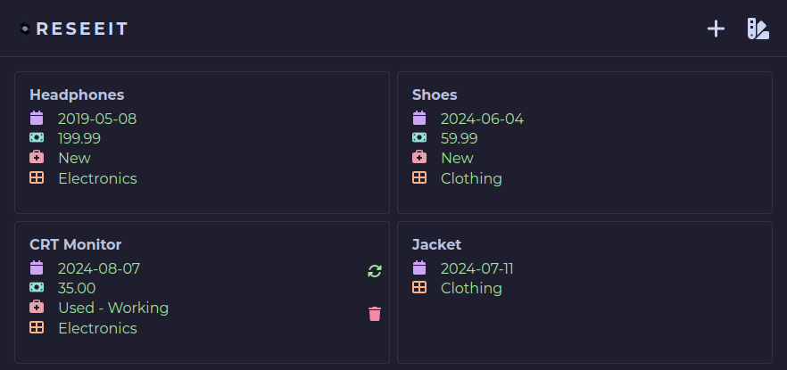
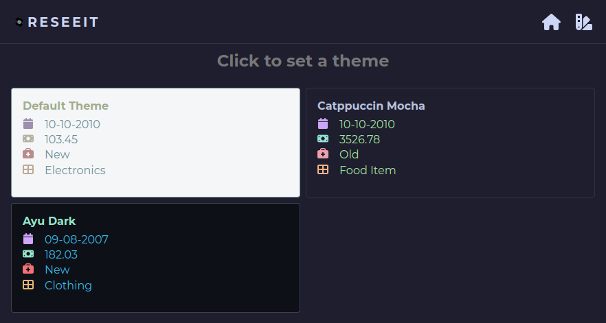
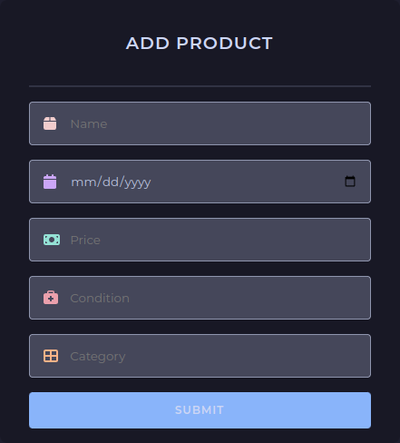
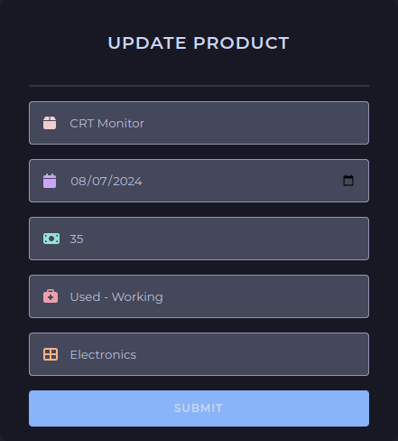

<a name="readme-top"></a>

<br />
<div align="center">
  <a>
    
  </a>

  <h3>Resseit</h3>

  <p align="center">
    Save your purchase details in a database instead of saving receipts.
  </p>
</div>

## About the Project

<p align="middle">
  
  
  
  
</p>

Save your purchase details electronically to determine what needs to be cut, monetary wise, or what needs upgrading (given date-of-purchase).

### Tech Stack
- [PostgreSQL] - Object-relational database system.
- [Express] - Back end web application framework for building RESTful APIs with Node.js.
- [React] - Front-end JavaScript library for building user interfaces.
- [NodeJS] - Cross-platform JavaScript runtime environment that lets developers create servers, web apps, command line tools and scripts.
- [Vite] - Local development server.

## Getting Started

> [!NOTE]
> You must have the technologies from the [tech stack](#tech-stack) installed on your system.

### PostgreSQL database
1. Ensure the database is running.
- Linux
```sh
$ sudo systemctl status postgresql
# ...
# Active: active (running) ...

# If inactive, start it with
$ sudo systemctl start postgresql
```

2. Create the necessary database and table given in the [db.sql](../server/db/db.sql) file.

### Express API
1. Create a `.env` file in the `server` directory with the following (replace `your_...` with your details or replace with the defaults given):
```dotenv
# API port
PORT=your_port            # default 3006

# PostgreSQL
PGUSER=your_user          # default postgres
PGPASSWORD=your_password
PGHOST=your_host          # default localhost
PGPORT=your_postgres_port # default 5432
PGDATABASE=reseeit
```
2. Start the Express API
```sh
# In the /server directory
$ npm start
```

### React client
1. Install the necessary modules.
```sh
# In the /client directory
$ npm i
```
2. Start the client server.
```sh
# In the /client directory

# Development
$ npm run dev

# Production
$ npm build
```
- Run the client in your browser with the given link after `npm run dev`.

- [Detailed building for production](https://vitejs.dev/guide/build)

## Theming
- Read the [wiki](https://github.com/happ-2h/Reseeit/wiki/Theming) article on theming.

## License
Distributed under the MIT License. See [LICENSE.txt](./LICENSE.txt) for more information.

<p align="right">(<a href="#readme-top">Back to top</a>)</p>


<!-- Reference Links -->
[PostgreSQL]: <https://www.postgresql.org/>
[Express]: <https://expressjs.com/>
[React]: <https://react.dev/>
[NodeJS]: <https://nodejs.org/>
[Vite]: <https://vitejs.dev/>